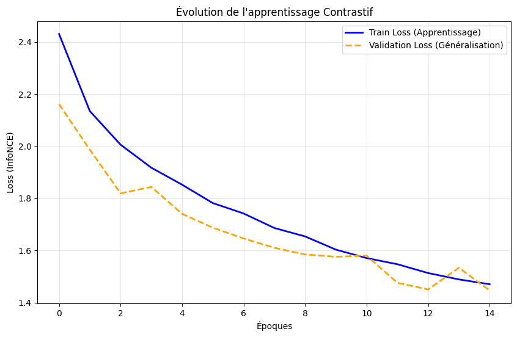
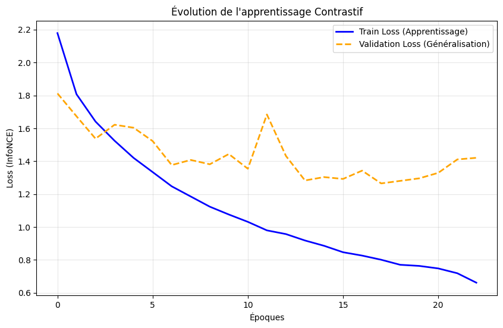
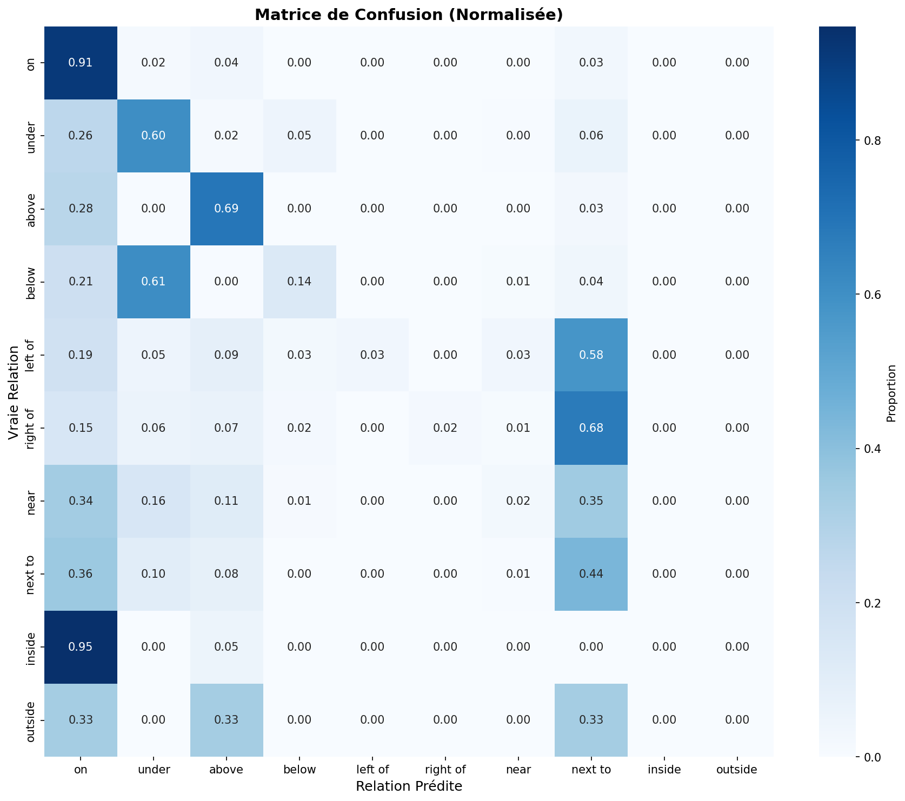

# Visual Spatial Relations Learning with Contrastive Embeddings

**Apprentissage de Relations Spatiales par Embeddings Contrastifs**

> Modélisation Systèmes Intelligents  - Modélisation des relations spatiales à partir de données raster . 

##

 📋 Résumé

Ce projet explore l'apprentissage par approche contrastive pour la détection de relations spatiales entre objets dans des images. En utilisant le dataset Visual Relationship Detection (VRD), nous développons des modèles dual-encodeurs qui apprennent à aligner les représentations visuelles et géométriques des relations spatiales.

**Résultats clés** :
- **62.40% accuracy** sur VRD (10 classes spatiales)
- Architecture dual-encoder : ResNet-50 (visuel) + MLP (spatial)
- Généralisation cross-dataset sur PSG (Recall@10: 84.26%)

---

## 🎯 Problématique

### Objectif
Développer un modèle capable de comprendre et classifier les **relations spatiales** entre objets détectés dans une image, en exploitant à la fois les informations visuelles et géométriques.

### Relations Spatiales Cibles (10 classes)

| Catégorie | Relations |
|-----------|-----------|
| **Verticales** | `above`, `below`, `on`, `under` |
| **Horizontales** | `left of`, `right of` |
| **Proximité** | `near`, `next to` |
| **Containment** | `inside`, `outside` |

### Challenges
- **Ambiguïté sémantique** : Frontières floues entre relations (near vs next to)
- **Déséquilibre des classes** : Ratio 344:1 (on vs outside)
- **Dépendance au contexte** : Interprétation variable selon échelle
- **Généralisation cross-dataset** : Transfer learning VRD → PSG

---

## 📊 Dataset: Visual Relationship Detection (VRD)

### Vue d'Ensemble

Le **Visual Relationship Detection (VRD)** dataset, introduit par Lu et al. (ECCV 2016), est un benchmark de référence pour la compréhension des relations visuelles entre objets.

**Statistiques Complètes** :
- **5,000 images** (4,000 train + 1,000 test), issues de MS-COCO et ImageNet
- **100 catégories d'objets** (person, car, table, chair, dog, etc.)
- **70 types de prédicats** (relations visuelles)
- **37,993 triplets annotés** au format $\langle$sujet, prédicat, objet$\rangle$
- Chaque triplet contient les bounding boxes des objets

### Types de Relations

Le dataset VRD couvre **70 prédicats** répartis en 4 catégories :

1. **Relations Spatiales** (notre focus) :
   - Verticales : on, above, below, under, over
   - Horizontales : left of, right of
   - Proximité : near, next to, beside
   - Containment : inside, outside, in

2. **Relations d'Action** :
   - Interactions : riding, holding, carrying, wearing, eating, drinking
   - Manipulations : touching, pushing, pulling, kicking

3. **Relations Comparatives** :
   - Tailles : taller than, shorter than, bigger than
   - Âges : older than, younger than

4. **Autres Relations** :
   - Propriétés : made of, has, part of, attached to
   - États : watching, looking at, playing with

### Notre Focus : 10 Relations Spatiales

Pour ce projet, nous nous concentrons sur **10 relations spatiales pures** :

| Catégorie | Relations | Support Test | % Total |
|-----------|-----------|--------------|---------|
| **Verticales** | on, above, below, under | 3,255 | 73.8% |
| **Horizontales** | left of, right of | 221 | 5.0% |
| **Proximité** | near, next to | 911 | 20.7% |
| **Containment** | inside, outside | 22 | 0.5% |
| **TOTAL** | **10 classes** | **4,409** | **100%** |

### Distribution des Classes (Test Set)

---

## 🏗️ Architecture

### Dual-Encoder Contrastive Learning

```
┌─────────────────────────────────────────────────────────────┐
│                    INPUT: Image + BBoxes                    │
│          (Subject BBox, Object BBox, Image Context)         │
└────────────────────┬─────────────────────────────────────────┘
                     │
        ┌────────────┴────────────┐
        │                         │
┌───────▼────────┐        ┌──────▼────────┐
│ VISUAL ENCODER │        │SPATIAL ENCODER│
│   (ResNet-50)  │        │     (MLP)     │
│                │        │               │
│ Crop Subject   │        │ Geometric Vec │
│ Crop Object    │        │   (8D)        │
│ Features 2048D │        │ ┌───────────┐ │
│      ↓         │        │ │ dx, dy    │ │
│ Concatenate    │        │ │ distance² │ │
│   4096D        │        │ │ angle     │ │
│      ↓         │        │ │ areas     │ │
│  Projection    │        │ └───────────┘ │
│  4096→1024→128 │        │ 8→64→128→128  │
└────────┬───────┘        └───────┬───────┘
         │                        │
         │   Embedding 128D       │   Embedding 128D
         └────────┬───────────────┘
                  │
          ┌───────▼───────┐
          │  CONTRASTIVE  │
          │     LOSS      │
          │  (InfoNCE /   │
          │   SupCon)     │
          └───────────────┘
```

### Architecture Détaillée

Notre approche **dual-encoder** apprend simultanément deux représentations complémentaires :

#### 1. Visual Encoder (ResNet-50)

**Objectif** : Capturer les caractéristiques visuelles des objets et leur contexte.

**Pipeline** :
1. **Extraction crops** : Deux crops 128×128 (sujet et objet) depuis l'image originale
2. **Feature extraction** : ResNet-50 pré-entraîné sur ImageNet (frozen)
   - Sujet : 2048D features
   - Objet : 2048D features
3. **Concatenation** : 4096D feature vector
4. **Projection MLP** : 4096D → 1024D → 128D
   - Reduce dimensionnalité
   - Dropout 0.3 pour régularisation
   - ReLU activations

**Pourquoi frozen backbone ?**
- Transfer learning depuis ImageNet (features génériques)
- Évite overfitting (dataset VRD relativement petit)
- Réduit coût computationnel

#### 2. Spatial Encoder (MLP)

**Objectif** : Encoder la géométrie pure de la relation spatiale.

**Pipeline** :
1. **Input** : Vecteur spatial 8D (voir section suivante)
2. **MLP 3 couches** : 8D → 64D → 128D → 128D
   - Expansion puis stabilisation
   - Dropout 0.2
   - ReLU activations
3. **Output** : Embedding spatial 128D

**Design clé** : Architecture légère car géométrie = information structurée

#### 3. Contrastive Loss (InfoNCE)

**Formulation** :
```
L = -log(exp(sim(z_v, z_s) / τ) / Σ exp(sim(z_v, z_s') / τ))
```

Où :
- `z_v` : embedding visuel (128D)
- `z_s` : embedding spatial (128D)
- `sim()` : similarité cosine (après L2 normalization)
- `τ = 0.07` : température

**Objectif** : Aligner embeddings visuels et spatiaux correspondants dans l'espace latent.

---

### Vecteur Géométrique (8D)

```python
spatial_vector = [
    dx_norm,      # Déplacement horizontal normalisé
    dy_norm,      # Déplacement vertical normalisé  
    distance²,    # Distance² normalisée par diagonal
    sin(θ),       # Angle direction (sin)
    cos(θ),       # Angle direction (cos)
    log(area_s),  # Log aire sujet
    log(area_o),  # Log aire objet
    iou           # Intersection over Union
]
```

---

## 📊 Protocole Expérimental

### Dataset: Visual Relationship Detection (VRD)

**Distribution** :
- Total: 5,000 images, 37,993 relations annotées
- **Train**: 4,000 images
- **Validation**: 1,000 images  
- **Test**: 4,409 échantillons (10 classes spatiales)

**Filtrage** : Relations spatiales uniquement (10 classes)

### Hyperparamètres

| Paramètre | Valeur |
|-----------|--------|
| Batch size | 16 |
| Learning rate | 1e-4 |
| Optimizer | Adam |
| Epochs max | 50 |
| Early stopping | 3 epochs patience |
| Embedding dim | 128D (visuel + spatial) |
| Image size | 128×128 |

### Régularisation

- **Backbone frozen**: Transfer learning depuis ImageNet
- **Dropout**: 0.3 (visual), 0.2 (spatial)
- **Data augmentation**: RandomHorizontalFlip, ColorJitter (train)
- **Early stopping**: Sur validation accuracy

---

## 🔬 Expériences Menées

### Vue d'Ensemble

| Exp | Architecture | Loss | Sampling | Classes | Val Acc | Test Acc |
|-----|--------------|------|----------|---------|---------|----------|
| **#1** | ResNet-18 | InfoNCE | Random | 10 VRD | 48.01% | **61.67%** |
| **#2** | ResNet-50 | InfoNCE | Balanced | 10 VRD | 56.88% | **62.40%** ⭐ |
| #3 | EfficientNet-B0 | InfoNCE | Random | 10 VRD | 51.62% | 56.54% |
| #4 | ResNet-18 | SupCon | Balanced | 10 VRD | - | (En cours) |
| #5 | ResNet-18 | SupCon | Balanced | 6 merged | 10% | Échec |
| #6 | ResNet-18 | InfoNCE | Random | 5 top | 44.3% | - |

---

## 📈 Résultats Détaillés

### Exp #1: Baseline (ResNet-18 + InfoNCE)

**Configuration** :
- Architecture: ResNet-18 (11M params, frozen)
- Loss: InfoNCE (self-supervised contrastive)
- Sampling: Random
- Epochs: 15 (early stopped)

**Training Curve** :

```
Epoch | Train Loss | Val Loss | Val Acc
------|------------|----------|--------
1     | 2.4303     | 2.1613   | 25.53%
5     | 1.8522     | 1.7402   | 39.20%
10    | 1.6030     | 1.5756   | 44.14%
15    | 1.4701     | 1.4463   | 48.01%
```


*Courbes d'entraînement Exp #1 (ResNet-18): Convergence à epoch 15*

**Résultats Test** :
- **Accuracy**: 61.67%
- Visual seul: 53.14%
- Spatial seul: 58.15%
- **Fusion (V+S)**: 61.67%

**Performance par Classe** :

| Classe | Precision | Recall | F1-Score | Support |
|--------|-----------|--------|----------|---------|
| on | 0.69 | 0.91 | 0.78 | 1867 ✅ |
| above | 0.71 | 0.68 | 0.69 | 714 ✅ |
| under | 0.44 | 0.59 | 0.51 | 431 ⚠️ |
| next to | 0.41 | 0.44 | 0.42 | 563 ⚠️ |
| below | 0.42 | 0.10 | 0.16 | 243 ❌ |
| left of | 1.00 | 0.02 | 0.03 | 116 ❌ |
| right of | 0.00 | 0.00 | 0.00 | 105 ❌ |
| near | 0.43 | 0.03 | 0.05 | 348 ❌ |
| inside | 0.00 | 0.00 | 0.00 | 19 ❌ |
| outside | 0.00 | 0.00 | 0.00 | 3 ❌ |

---

### Exp #2: Meilleur Modèle (ResNet-50 + InfoNCE) ⭐

**Configuration** :
- Architecture: ResNet-50 (25M params, frozen)
- Loss: InfoNCE (contrastive)
- Sampling: Balanced batch sampler
- Epochs: 23 (early stopped)

**Training Curve** :

```
Epoch | Train Loss | Val Loss | Val Acc
------|------------|----------|--------
1     | 2.1788     | 1.8121   | 36.50%
5     | 1.4200     | 1.6035   | 47.39%
10    | 1.0760     | 1.4436   | 52.48%
15    | 0.8858     | 1.3034   | 55.94%
20    | 0.7634     | 1.2958   | 57.79%
23    | 0.6615     | 1.4205   | 56.88%
```


*Courbes d'entraînement Exp #2 (ResNet-50): Convergence plus stable, loss finale plus basse*

**Résultats Test** :
- **Accuracy**: 62.40%
- Visual seul: 55.50%
- Spatial seul: 58.74%
- **Fusion (V+S)**: 62.40% 🏆

**Performance par Classe** :

| Classe | Precision | Recall | F1-Score | Support |
|--------|-----------|--------|----------|---------|
| on | 0.70 | 0.91 | 0.79 | 1867 ✅ |
| above | 0.73 | 0.69 | 0.71 | 714 ✅ |
| under | 0.46 | 0.60 | 0.52 | 431 ✅ |
| next to | 0.40 | 0.44 | 0.42 | 563 ⚠️ |
| below | 0.49 | 0.14 | 0.21 | 243 ❌ |
| left of | 0.50 | 0.03 | 0.06 | 116 ❌ |
| right of | 0.50 | 0.02 | 0.04 | 105 ❌ |
| near | 0.33 | 0.02 | 0.04 | 348 ❌ |
| inside | 0.00 | 0.00 | 0.00 | 19 ❌ |
| outside | 0.00 | 0.00 | 0.00 | 3 ❌ |

**Matrice de Confusion** :


*Matrice de confusion (10×10): Excellente performance sur "on" et "above", confusion sur classes rares*

**Observations** :
- **Diagonale forte** : on (1700/1867), above (492/714)
- **Confusion principale** : Classes rares → prédites comme "on" (biais)
- **Pattern** : near ↔ next to (ambiguïté sémantique)

**Amélioration vs Exp #1** :
- Accuracy: +0.73 points
- F1-Score moyen pondéré: +0.01
- Meilleure convergence (loss plus bas)
- Légère amélioration sur classes rares

---

### Exp #3: EfficientNet-B0

**Résultats** :
- Test Accuracy: 56.54%
- Architecture plus compacte mais features moins riches
- Training plus rapide mais performances inférieures

---

### Autres Expériences

**Exp #4** : Supervised Contrastive + Balanced sampling (en cours)

**Exp #5** : Classes fusionnées (6 classes)
- Tentative de fusion sémantique: "vertical", "horizontal", "contact"...
- **Échec**: 10% accuracy (confusion totale)
- Leçon: La granularité originale est nécessaire

**Exp #6** : Top-5 classes (on, above, under, next to, below)
- 44.3% accuracy sur 5 classes sélectionnées
- Objectif: Réduire déséquilibre
- Résultat mitigé: Classes rares toujours problématiques

---

## 🌍 Généralisation Cross-Dataset (PSG)

### Transfer Learning VRD → PSG

Pour tester la capacité de généralisation, nous avons évalué le modèle VRD sur le dataset **Panoptic Scene Graph (PSG)** :

**Protocole** :
1. Utiliser les embeddings pré-entraînés (Exp #2)
2. Entraîner un classifier SVM sur embeddings PSG
3. Évaluer avec Recall@K metrics

**Résultats (56 classes PSG complètes)** :
```
Accuracy (top-1):  35.27%
Recall@1:          35.27%
Recall@5:          72.87% ✅
Recall@10:         84.26% ✅
```

**Résultats (14 classes spatiales PSG)** :
```
Accuracy:          43.11%

Classes performantes:
- over:        69% F1
- on:          51% F1
- beside:      47% F1
- in front of: 45% F1
```

**Analyse** :
- ✅ Bonne généralisation sur relations spatiales pures
- ❌ Faible performance sur actions (eating, holding...)
- ✅ Recall@10 excellent (84%) → Bon pour retrieval
- Limitation: Features spatiales ne capturent pas détails visuels d'actions

---

## 💡 Analyse et Insights

### Forces du Modèle

1. **Relations dominantes** : Excellent sur "on", "above" (F1 > 70%)
2. **Fusion efficace** : Visual + Spatial > chacun séparément
3. **Transfer learning** : Generalise aux relations spatiales cross-dataset
4. **Embeddings riches** : Recall@10 = 84% sur PSG

### Limitations

1. **Classes rares** : "outside", "inside", "right of" (< 20 samples) → 0% F1
2. **Ambiguïté sémantique** : "near" vs "next to" difficile à distinguer
3. **Déséquilibre** : "on" domine (42%) → biais de prédiction
4. **Actions** : Features géométriques insuffisantes pour actions visuelles

### Insights Clés

| Observation | Implication |
|-------------|-------------|
| ResNet-50 > ResNet-18 | Features plus riches améliorent légèrement |
| Spatial Encoder performant | Géométrie capture bien relations pures |
| Classes rare problem | Besoin oversampling ou hard negative mining |
| Cross-dataset OK pour spatial | Embeddings spatiaux généralisent |

---

## 🚀 Utilisation

### Installation

```bash
# Clone repository
git clone https://github.com/[your-username]/MSI-Projet_Spatial_Relations.git
cd MSI-Projet_Spatial_Relations

# Install dependencies
pip install -r requirements.txt
```

### Dataset VRD

Télécharger le [VRD dataset](https://cs.stanford.edu/people/ranjaykrishna/vrd/) et placer dans `vrd/`:

```
vrd/
├── images/
├── annotations_train.json
└── annotations_test.json
```

### Entraînement

```bash
# Train baseline
python -m src.train

# Result will be saved in checkpoints/exp_YYYYMMDD_HHMMSS/
```

### Évaluation

```bash
# Evaluate checkpoint
python -m src.evaluate checkpoints/exp_YYYYMMDD_HHMMSS

# Cross-dataset evaluation (PSG)
python scripts/evaluate_psg_full56.py
```

---

## 📁 Structure du Projet

```
MSI-Projet_Spatial_Relations/
│
├── README.md                    ← Ce fichier
├── requirements.txt             ← Dépendances Python
├── .gitignore
│
├── src/                         ← Code source principal
│   ├── config.py                ← Configuration système
│   ├── dataset.py               ← DataLoader VRD
│   ├── model.py                 ← Architectures encodeurs
│   ├── train.py                 ← Pipeline entraînement
│   ├── evaluate.py              ← Évaluation checkpoints
│   └── utils/
│       └── geometry.py          ← Calculs géométriques
│
├── scripts/                     ← Scripts utilitaires
│   ├── analyze_dataset.py
│   ├── visualize_vrd.py
│   └── evaluate_psg_full56.py   ← Éval cross-dataset
│
├── experiments/                 ← Documentation expériences
│   ├── README.md                ← Vue d'ensemble résultats
│   ├── EXP2_CONFIG.md
│   └── results/
│       └── psg_evaluation.txt
│
└── assets/                      ← Images README
    └── loss_curve.png
```

---

## 📚 Références

### Datasets
- **VRD**: Lu et al. ["Visual Relationship Detection with Language Priors"](https://cs.stanford.edu/people/ranjaykrishna/vrd/), ECCV 2016
- **PSG**: Yang et al. ["Panoptic Scene Graph Generation"](https://psgdataset.org/), ECCV 2022

### Méthodes
- **InfoNCE Loss**: Oord et al. "Representation Learning with Contrastive Predictive Coding", 2018
- **Supervised Contrastive**: Khosla et al. "Supervised Contrastive Learning", NeurIPS 2020
- **ResNet**: He et al. "Deep Residual Learning for Image Recognition", CVPR 2016

### Frameworks
- PyTorch 2.0
- torchvision (pre-trained models)
- scikit-learn (SVM evaluation)

---

## 👨‍🎓 Contexte Académique

Ce projet a été réalisé dans le cadre d'un Master en Vision par Ordinateur, avec un focus sur :
- L'apprentissage contrastif pour la vision
- La compréhension des relations spatiales
- La généralisation cross-dataset
- L'évaluation scientifique rigoureuse

**Compétences ** :
- Implémentation PyTorch avancée
- Conception d'architecture dual-encoder
- Expérimentation systématique (6 configurations)
- Analyse quantitative et qualitative
- Transfer learning cross-dataset

---

## 📧 Contact

El haj Samitt Ebou 
el-haj-samitt.ebou@etu.u-paris.fr 


